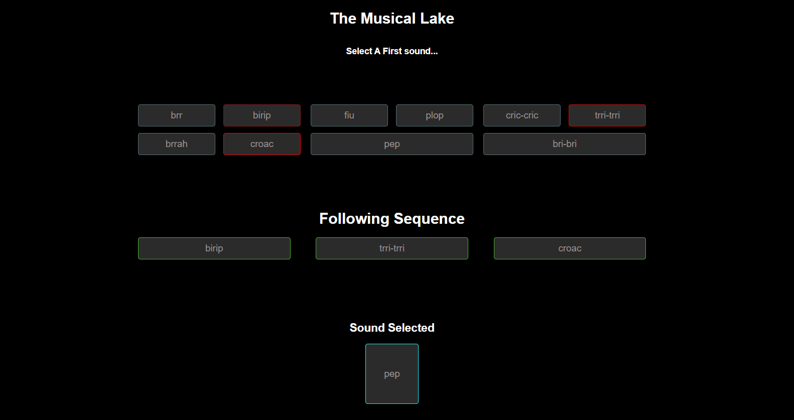

# the-musical-lake-ap

One day, an explorer started following some strange sounds; he then arrived at a lake where he found the source: 3 little animals making music-like sounds. 
A short time passed, and the explorer was able to differentiate which animal produced which sound. 
Sounds 

-	Frog: brr, birip, brrah, croac
-	Dragonfly: fiu, plop, pep
-	Cricket: cric-cric, trri-trri, bri-bri

After a while, he discovered that they were "singing" together. Whenever the frog started with brr, the dragonfly responded to its sound by rubbing its tail with a branch producing a sound as fiu; after the dragonfly, the cricket continued with cric-cric. However, every time the frog sounded as brrah or croac, all animals would mute for a while, and then they continued all over again. Before the sky was dark, the explorer was able to write 3 "songs" they all did together and came up with these notes. 

Songs 
-	brr, fiu, cric-cric, brrah
-	pep, birip, trri-trri, croac
- bri-bri, plop, cric-cric, brrah

## Exercise
Write a program that lets you receive a given sound from the list of sounds each animal does and returns the remaining sounds of any of the 3 songs that the explorer wrote e.g.: 
•	When given brr it should reproduce fiu, cric-cric, brrah according to the first song
•	When given birip it should reproduce trri-trri, croac according to the second song
•	When given plop it should reproduce cric-cric, brrah according to the third song
•	When given croac or brrah it shouldn't reproduce anything according to all songs


## Solution



## Project setup
```
npm install
```

### Run project
```
npm run serve

Commonly will run in: http://localhost:8080/ 
```
## Run tests
```
npm run test 

Tests by Jest
```
